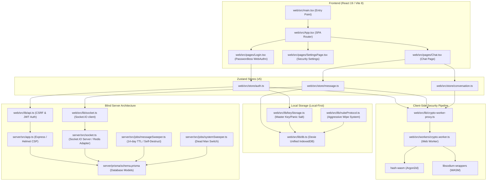

# NYX Core Architecture & Domain Knowledge Brain Dump

NYX is a **Zero-Knowledge Post-Quantum Hardened Messenger** designed around a strict **Trust No One (TNO)** model. The central design principle is that the server acts as a blind relay and transient message queue, possessing zero knowledge of the encryption keys, message plaintext, file contents, or users' real-world identities. 

---

## 1. High-Level App Architecture & Purpose

NYX utilizes a local-first architecture to protect user privacy. All sensitive information (including decryption keys, chat histories, and profile metadata) is encrypted and decrypted purely on the client-side, with the client holding all master secrets.

```
                                  +---------------------------------------+
                                  |            Browser Client             |
                                  |                                       |
                                  |  +---------------------------------+  |
                                  |  |            React App            |  |
                                  |  +----------------+----------------+  |
                                  |                   |                   |
                                  |                   v                   |
                                  |  +---------------------------------+  |
                                  |  |      Zustand Stores (v5)        |  |
                                  |  +----------------+----------------+  |
                                  |                   |                   |
                                  |                   v                   |
                                  |  +---------------------------------+  |
                                  |  |      crypto-worker-proxy        |  |
                                  |  +----------------+----------------+  |
                                  |                   |                   |
                                  |         (Async PostMessage)           |
                                  |                   |                   |
                                  |                   v                   |
                                  |  +---------------------------------+  |
                                  |  |    Web Worker (crypto.worker)   |  |
                                  |  |  [Libsodium WASM & hash-wasm]   |  |
                                  |  +----------------+----------------+  |
                                  |                   |                   |
                                  |                   v                   |
                                  |  +---------------------------------+  |
                                  |  |      Local DB (Dexie/IndexedDB)  |  |
                                  |  +---------------------------------+  |
                                  +-------------------+-------------------+
                                                      |
                                        (E2EE Signal / WebSockets)
                                                      |
                                                      v
                                  +-------------------+-------------------+
                                  |          Express & Socket.IO          |
                                  |               Server                  |
                                  +-------------------+-------------------+
                                                      |
                                                      v
                                  +-------------------+-------------------+
                                  |            PostgreSQL                 |
                                  |            (Prisma ORM)               |
                                  +---------------------------------------+
```

### Core Architectural Concepts:
- **Zero-Knowledge User Profiles:** User profiles are symmetrically encrypted on the client side using a key derived from the master seed and stored on the server as blind base64-encoded strings (`encryptedProfile`).
- **Post-Quantum Security:** High-security handshakes utilize a hybrid scheme: classical **X25519** combined with **ML-KEM-768** (via the X-Wing hybrid KEM algorithm).
- **Double Ratchet / Group Ratchet:** Messages are encrypted using end-to-end symmetric keys updated per-message using a cryptographic double ratchet for active confidentiality and forward secrecy.
- **Local Keystores:** Private key bundles are stretched with **Argon2id** (via a WASM worker implementation) and stored encrypted within IndexedDB (`kvStore`).
- **Decoy Mode:** Supports a decoy environment where the interface displays spoofed messages and keys to protect against physical coercion.

---

## 2. Core Component Dependency Graph



---

## 3. Critical Files & Entry Points

### Frontend (Client-Side)

| File Path | Distinct Responsibility |
| :--- | :--- |
| **[main.tsx](file:///root/nyx-chat/web/src/main.tsx)** | Core entry point. Mounts the React application with a global `HelmetProvider`, registers the background Service Worker, sets up deep circular-dependency breaking authentication failure handlers, and injects console security watermarks. |
| **[App.tsx](file:///root/nyx-chat/web/src/App.tsx)** | Controls global routing, registers command palettes, initializes system shortcut keys, listens to incoming navigation instructions from service workers, and controls global modals. |
| **[crypto.worker.ts](file:///root/nyx-chat/web/src/workers/crypto.worker.ts)** | **Sacred Cryptographic Core.** Runs in a background thread. Manages private keys, Argon2id key stretching, X-Wing Hybrid KEM key pair generation, X3DH handshakes, Double Ratchet state updates, Group Ratchets, and secure memory sanitization (`sodium.memzero`). |
| **[crypto-worker-proxy.ts](file:///root/nyx-chat/web/src/lib/crypto-worker-proxy.ts)** | Interacts with the worker via async `postMessage` calls wrapped in transactional Promises, providing structured interfaces for profile encryption, Username Hashing, Proof of Work mining, and asymmetric sealed boxes. |
| **[db.ts](file:///root/nyx-chat/web/src/lib/db.ts)** | Declares the Dexie-based schema `NyxUnifiedDB`. Configures IndexedDB storage collections for E2EE messages (`messages`), story keys, offline queues, key-value stores (`kvStore`), and various protocol identity/session keys. |
| **[keyStorage.ts](file:///root/nyx-chat/web/src/lib/keyStorage.ts)** | Handles secure persistent credential management. Derives keys via WASM Argon2id and configures Argon2id-hashed Panic Passwords to instantly destroy data under physical duress. |
| **[nukeProtocol.ts](file:///root/nyx-chat/web/src/lib/nukeProtocol.ts)** | Implements the **Nuclear Option**. Aggressively releases file locks, completely deletes all local IndexedDB vaults, clears LocalStorage/SessionStorage, unregisters active service worker caching footprints, and drops memory contexts via hard redirect. |

### Backend (Server-Side)

| File Path | Distinct Responsibility |
| :--- | :--- |
| **[index.ts](file:///root/nyx-chat/server/src/index.ts)** | Bootstraps the application. Connects to Redis first, then loads dynamic Express app handlers, WebSockets, background sweepers, and listens on the configured system port. |
| **[app.ts](file:///root/nyx-chat/server/src/app.ts)** | Configures the Express engine. Enforces strict Helmet Content Security Policies (with explicit rules for WebAssembly, inline scripts, and Cloudflare challenge routes), handles double CSRF protections, limits request sizes to prevent DoS, and implements static upload routing. |
| **[socket.ts](file:///root/nyx-chat/server/src/socket.ts)** | Coordinates real-time events. Integrates the Socket.IO Redis Adapter for horizontal scalability, extracts cookies to perform secure handshakes, manages device revocation checks against Redis, and relays Blind Key Exchanges / Encrypted Group Fan-outs. |
| **[schema.prisma](file:///root/nyx-chat/server/prisma/schema.prisma)** | Configures Postgres database models. Houses relational schemas for `User`, multi-device credentials (`Device`, `OneTimePreKey`, `PreKeyBundle`), secure conversation metadata (`Conversation`, `Participant`), E2EE `Message`, and WebAuthn authenticators. |
| **[messageSweeper.ts](file:///root/nyx-chat/server/src/jobs/messageSweeper.ts)** | Run every 60 seconds. Performs cascading batch deletes of all messages that have expired (due to custom self-destruct timers) or reached the global server TTL threshold of 14 days. Emits expiration events via WebSockets to synchronize client databases. |
| **[systemSweeper.ts](file:///root/nyx-chat/server/src/jobs/systemSweeper.ts)** | Scheduled daily at 00:00. Sweeps revoked/expired Refresh Tokens, cleans stale session states, passive-downgrades expired subscriptions, and triggers the **Dead Man's Switch** to completely purge dormant accounts from the system. |

---

## 4. Coding Style Rules & Conventions

To maintain backward cryptographic compatibility and overall system stability, developers must strictly adhere to the following project conventions:

1. **Strict Package Manager Rule:**
   - Exclusively use `pnpm` for installing and managing dependencies. Never run `npm` or `yarn` inside this workspace to avoid breaking lockfile integrity.

2. **Immutable Cryptography Core:**
   - Under no circumstances should `libsodium-wrappers` or its TypeScript declarations be updated or modified. Backward cryptographic compatibility is crucial for users to consistently decrypt historical messages stored inside their local `shadowVaultDb`.

3. **Zustand State Access & Selectors:**
   - When pulling values from Zustand stores (v5), **never return objects inside selectors without wrap-securing them in `useShallow`**. Failure to do so will cause frequent infinite-render loops and crash the interface.
   - *Correct:* `const { user, isBootstrapping } = useAuthStore(useShallow(s => ({ user: s.user, isBootstrapping: s.isBootstrapping })));`
   - *Incorrect:* `const { user, isBootstrapping } = useAuthStore(s => ({ user: s.user, isBootstrapping: s.isBootstrapping }));`

4. **Linting & Formatting Standard:**
   - The project uses **ESLint v10 (Flat Config)**. Code must pass `pnpm run lint` with zero warnings before committing. (Only the `no-unused-vars` rule can be ignored, per the master README).

5. **Local-First Synchronization flow:**
   - Always commit new messages to the IndexedDB table (`messages`) optimistically prior to initiating WebSocket/REST deliveries. If the client is offline, the message remains stored in `offlineQueue` until connection state is restored.

6. **Secure Memory Cleansing:**
   - For all processes handling raw secrets (such as master seeds, encryption keys, or private key materials), always wrap the process in a `try...finally` block. Inside the `finally` statement, use `sodium.memzero(...)` to actively clear the memory buffer and prevent heap leaks.

7. **Structured Conventional Commits:**
   - Always formulate commit logs using strict semantic definitions (e.g. `feat: add post-quantum pre-keys`, `fix: enforce strict helmet CSP for webassembly`).

---

*This brain dump acts as the single source of truth for the codebase architecture. Refer to it during development and code review.*
