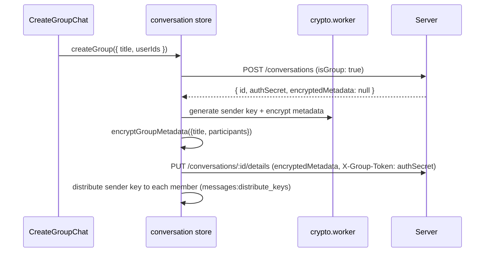

# 16 — Groups

How group conversations are created, how metadata and messages are encrypted, how sender keys are distributed, and how membership changes are handled.

> **✅ Blueprint 26 IMPLEMENTED (2026-09-26).** The group-privacy tiers are
> shipped and supersede parts of this document:
>
> | Tier | What changed | Section |
> |---|---|---|
> | **T1** | Sender pseudonyms — group `senderId` is a per-group random pseudonym (metadata v2 `pseudonymMap`, generation counter); server stores verbatim | replaces 16.4 routing notes |
> | **T3a** | Group `MessageStatus.userId` stores the reader's **pseudonym**, not the account id | new |
> | **T3b** | Blinded membership discovery via per-member **delivery tokens** (`UserHiddenConversation.deliveryToken`, dual-accept sync) | extends 16.5 |
> | **T2** | Sender keys distributed **inside pairwise DR sessions** (`GROUP_KEY` silent control, virtual `<group>:pw:<peer>` conv id); `messages:distribute_keys` is now the legacy fallback | supersedes 16.4 delivery |
> | **T4** | Opt-in application-level **cover traffic** (Poisson scheduler, `COVER` silent type, drop-after-decrypt) | new |
>
> Design rationale, threat model, and residual leaks: **docs/26-group-privacy-blueprint.md** (decisions locked in 26.7). This document remains accurate for the 1:1 sealed-sender path, legacy (v1) groups, and the metadata decryption-once fix (16.3).

## 16.1 Overview

Groups use the **Sender-Key protocol** (client-side fan-out). The server is a blind relay: it never sees group keys, member names, or message content — only opaque conversation records and ciphertext.

**Key files:** `web/src/store/conversation.ts` (group creation + metadata), `web/src/utils/crypto.ts` (`ensureGroupSession`, `encryptGroupMetadata`, `decryptGroupMetadata`), `web/src/lib/keychainDb.ts` (sender-key state at rest), `web/src/store/message.ts` (group send path), `server/src/routes/conversations.ts`, `server/src/routes/messages.ts`.

## 16.2 Creation flow

- `authSecret` is a blind authorization token: the server checks `X-Group-Token` against it for detail/participant mutations, without knowing who the admin is.
- The group creator distributes its sender key to every participant via `messages:distribute_keys` → persisted as SYSTEM messages so offline members receive keys later.

## 16.3 Metadata encryption & the "Unknown Group" problem

- Group metadata (title, participant list) is encrypted with the creator's sender key at ratchet **N=0**.
- **Decryption-once problem:** the sender-key ratchet advances past N=0 as messages are decrypted. Re-decrypting metadata at N=0 later fails, which would show the group as "Unknown" and hide its messages.
- **Fix (persistence):** after the first successful metadata decrypt, the result is persisted to the Shadow Vault (`saveConversation` → `db.conversations.decryptedMetadata`), so subsequent loads reuse the cache instead of re-decrypting. Participant IDs are additionally cached via `saveCachedGroupParticipants`.

## 16.4 Sender-key distribution & rotation

- Each sender maintains its own chain key `{CK, N, skippedKeys}` per conversation (`groupSenderStates`); each recipient maintains a per-sender receiver state (`groupReceiverStates`) — all encrypted at rest with the `ENC1:` envelope.
- **[T2 — implemented]** Distribution rides the pairwise DR session per peer as a silent `GROUP_KEY` control message (virtual `<group>:pw:<peer>` conversation id); the legacy `GROUP_KEY_DISTRIBUTION` / `messages:distribute_keys` path below is the fallback for devices without a pairwise session.
- Control message `GROUP_KEY_DISTRIBUTION` carries per-recipient `encryptedKey` + `senderDeviceKey` (and optionally a DR header) — delivered in-band and processed first by the offline sync path.
- **[T1 — implemented]** Group senders sign/route with a per-group pseudonym (metadata v2); receiver states key off the resolved sender.
- **Rotation invariants (fixed 2026-10):** `fulfillGroupKeyRequest` always seals the chain key at its **initial state `(initialCK, N=0)`** (`GroupSenderState.initialCK` is persisted at rest) so late joiners decrypt metadata again; metadata mutations redistribute the **same** era via `redistributeCurrentGroupKey` instead of minting a second era per change (the old double-era bug left new members in `waiting_for_key` forever). A fresh era is only created when the sender state is empty.
- **Rotation** (`forceRotateGroupSenderKey`): triggered on participant add/remove, crypto change, or manual "repair secure session". Rotation also re-encrypts metadata v2 with a fresh pseudonym map (generation+1) — delivery-token maps are inherited, never rotated.

## 16.5 Membership operations

| Op | Client | Server |
|---|---|---|
| Add participant | `addParticipants` | `POST /:id/participants` (X-Group-Token) → broadcast `conversation:new` |
| Remove participant | `removeParticipant` | `DELETE /:id/participants/:userId` → `conversation:participant_removed` |
| Leave (member) | solo-leave dialog | `DELETE /:id/leave` — MEMBER leaves without purge |
| Leave (admin/owner) | warning dialog → confirm | `DELETE /:id/group` (purge) + auto-transfer owner to the earliest-joined remaining member |
| Delete (admin) | `deleteGroup` | `DELETE /:id/group` → `conversation:deleted` (X-Admin-Token guard; 409 `MEMBERS_REMAIN` while delivery tokens remain) |

All membership changes force a sender-key rotation so removed members cannot read future messages (PFS for groups).

### 16.5.1 Admin capability token (RBAC, 2026-10)

The server never learns roles (Opaque Mailbox), so authorization = possession of a capability:

- **Creation:** `createGroup` generates a random 256-bit admin token client-side; the server receives only its SHA-256 hex (`Conversation.adminSecretHash`, validated `^[a-f0-9]{64}$`). The client caches the plaintext token per conversation in kvStore `nyx_group_admin_tokens` (at-rest `ENC1:`), hydrated in `loadConversations`.
- **Guard:** `requireAdminCapability` (`server/src/utils/adminCapability.ts`) gates `PUT /:id/details`, `POST /:id/key-rotation`, and `DELETE /:id/group` via header `X-Admin-Token` (constant-time compare against the stored hash). **NULL hash = legacy bypass** — pre-RBAC groups keep using `X-Group-Token`.
- **Distribution:** the token is sealed pairwise (`pq_box_seal`) to each member and relayed via `group:fulfilled_key` with the `adminToken: true` flag (realtime + offline sync branch in `message.ts` — processed as a capability, never as a chain key). Done at group creation, on MEMBER→ADMIN promotion, re-sealed to all other admins on every `rotateGroupKey`, and transferred to the successor admin when the owner leaves.
- **UI gating:** rotate-key button (`amIAdmin`), "Delete Group" menu/swipe entry (`canDeleteGroup`), and the solo-leave dialog variant all check admin status locally; the server-side guard is the source of truth.
- **Trade-off:** the server cannot distinguish between admins and a stolen token stays valid until the next rotation — mitigated by re-sealing on every membership change.

**[T3b — implemented]** Adds/leaves/kicks also write or delete the member's **delivery token** row (`UserHiddenConversation.deliveryToken`): tokens are issued by the inviter at add-time and revoked (= row deleted) on kick/leave, so kicked members lose discovery access without any identity join. Full design: docs 26.2 / 26.10.

## 16.6 Group info & UI

- `GroupInfoPanel` / `EditGroupInfoModal` show/edit the decrypted metadata; `ParticipantList` renders members from the decrypted participant list (with per-user profile enrichment via `useUserProfile`).
- `AddParticipantModal` picks users and triggers the add flow.

## 16.7 Edge cases & invariants

- **Metadata missing → "Unknown":** now mitigated by persisting decrypted metadata; if it still happens, `repairSecureSession` / a ghost sync re-fetches the group key.
- **Member sends before metadata decrypt:** non-creator members reconstruct the participant list from `getCachedGroupParticipants` (opaque-mailbox fallback) so they can send immediately.
- **Key rotation pending:** `requiresKeyRotation` flag + `fireGhostSync` reconcile state after a metadata/participant mismatch.

### 16.7.1 The four era invariants (2026-10, libsignal-derived)

Adopted after comparing the group pipeline against libsignal's `SenderKeyRecord` /
`process_sender_key_distribution_message` (`~/signal/libsignal/.../sender_keys.rs`,
`group_cipher.rs`). These invariants eliminate the whole class of
"decrypted-then-failed-again" bugs (reload / relogin / kick+re-add):

1. **Multi-era receiver state.** Receiver states carry an **era anchor**
   (`GroupReceiverState.eraCK` = chain key at the start of the era, N=0). Before a
   new era overwrites the current state, the old state is **archived**
   (`archiveGroupReceiverState`, id `` `${id}#era_${CK8}` ``, max 5 — mirrors
   `MAX_SENDER_KEY_STATES=5`) and stays routable via the keyId scan in
   `getGroupReceiverStateByKeyId`. **Never overwrite a live era.**
2. **Idempotent receive.** A re-delivered distribution for the **same** era is a
   no-op — it must never rewind a receiver that already advanced (the 2026-10-02
   rewind bug: persistent `fulfilled_key` envelopes replay on every offline sync,
   comparing raw CK made each replay look like a new era). Detection logic is the
   pure helper `isSameEraDistribution` (`web/src/lib/groupEra.ts`, unit-tested in
   `groupEra.test.ts`); legacy anchor-less states are handled safely.
3. **Persist-before-render.** Successful `reDecryptPendingMessages` results are
   written to the Shadow Vault (previously Zustand-only — bubbles looked fine but
   the vault still held the failure, so a reload lost them). `upsertMessages`
   **rejects every failure bubble** (`m.error` or any failure string — the old
   Indonesian failure strings slipped the hasContent filter and got poisoned
   permanently, with the "prevent overwriting valid message" shield protecting
   the *failure*). The `isLocalValid` blacklist in both load paths is widened so
   poisoned tombstones are re-decryptable when keys arrive.
4. **Targeted heal.** Key requests go **to the sender of the failed message**
   (pseudonym → userId resolve), not broadcast to the group — mirrors Signal's
   `DecryptionErrorMessage` flow (`Signal-Desktop ts/util/handleRetry.preload.ts`,
   5-retry / 14-day limits there). The first-message-of-a-new-group bug is closed
   by hooking `reDecryptPendingMessages` to the moment metadata **newly** decrypts
   in `addOrUpdateConversation` (previously `storeReceivedSessionKey` skipped the
   re-decrypt while metadata was pending and nothing followed up).

Also (MK persistence): group **skipped keys are no longer deleted after use** —
capped at 200/conversation (LRU) in `storeGroupSkippedKey` — so repeated reloads
can still decrypt messages whose message keys the ratchet already passed.

### 16.7.2 Sender-key rewrite: true libsignal model (2026-10-02)

After 30+ incremental fixes kept hitting the same layer, the group sender-key
pipeline was rewritten in place to follow `sender_keys.rs` exactly. The
invariants below replace all earlier patches (§16.7.1 stays valid):

1. **Metadata is a real chain message — no position reuse.** The old
   `encryptGroupMetadata` restored the sender state after encrypting, so the
   next real message reused the metadata's position AND message key (the
   "twin"). Arrival order then decided success: the loser failed permanently
   with `Ratchet Advanced (header.n=0, state.N=1)`. Now metadata consumes a
   position like any message; `persistState:false` and the restore hack are
   gone.
2. **`chainId` is the era identity (libsignal `chain_id`).** Every new wrapper
   (messages + metadata) carries `chainId = initialCK[0:8]` — stable for the
   whole era, unlike `keyId` (= CK at the message's own position). Receiver
   routing goes through the pure helper `pickChainState` (`web/src/lib/groupEra.ts`,
   unit-tested): match `chainId`/`keyId` against current + archived states
   (newest first, max 5 — `MAX_SENDER_KEY_STATES`), never guess. Legacy
   wrappers without `chainId` fall back to keyId matching.
3. **Skipped message keys live in the state record** (`sender_message_keys`).
   The record's map is passed into `group_ratchet_decrypt`, which consumes the
   used key and appends gap keys to the returned state; the record is persisted
   including the map. The `groupSkippedKeys` table remains a mirror keyed by
   the **stable** chainId alias. The old unfiltered array-scan fallback in
   `getGroupSkippedKey` (matched `(conv, sender, n)` ignoring chain AND device)
   is removed — it handed back wrong-era MKs once same-position entries from
   multiple eras existed (MAC failures for established members, log 17:06).
4. **Migration heal, bounded.** Legacy records that advanced past a position
   without a stored skipped key re-derive from `(eraCK, 0)` once on
   `Ratchet Advanced` (the anchor is persisted anyway and the KDF chain is
   deterministic — nothing is lost). New-format traffic no longer creates such
   states.
5. **`group:request_key` routing via device key.** The server resolves the
   fulfiller by `targetDeviceKey` (`Device.publicKey` → userId) when
   `targetSenderId` is an unresolvable pseudonym — a member whose metadata is
   still undecrypted can reach every sender, not only the creator (whose
   metadata wrapper is the only one carrying a raw userId).

## 16.8 Files to know

| File | Role |
|---|---|
| `web/src/store/conversation.ts` | `createGroup`, `addOrUpdateConversation`, `updateConversation`, participant ops |
| `web/src/utils/crypto.ts` | `ensureGroupSession`, `encryptGroupMetadata`, `decryptGroupMetadata`, `forceRotateGroupSenderKey` |
| `web/src/lib/keychainDb.ts` | sender/receiver ratchet state, era archives (`archiveGroupReceiverState`), skipped keys (LRU-capped), cached participants, at-rest encryption |
| `web/src/lib/messagePipeline.ts` | `GROUP_KEY_DISTRIBUTION` control handling |
| `server/src/routes/conversations.ts` | group endpoints + blind auth (`X-Group-Token`) + admin capability guard (`X-Admin-Token`) |
| `server/src/utils/adminCapability.ts` | `extractHeader`, `hashAdminToken`, `isAdminTokenValid` (+ 12 unit tests in `server/tests/adminCapability.test.ts`) |
| `web/src/lib/groupPseudonyms.ts` | `generateAdminCapabilityToken` / `storeMyAdminToken` / `hydrateMyAdminTokens` (kvStore `nyx_group_admin_tokens`) |
| `web/src/lib/groupEra.ts` | `isSameEraDistribution` — pure replay/era detection (invariant 2, unit-tested) |
| `server/src/network/redisBridge.ts` | `messages:distribute_keys`, `group:*` events |

**[Blueprint 26 additions]** `web/src/lib/groupPseudonyms.ts` (pseudonym + delivery-token maps), `web/src/lib/coverTraffic.ts` (Poisson cover scheduler), `web/src/utils/typeGuards.ts` (`GROUP_KEY` / `COVER` silent types), `server/tests/deliveryTokens.test.ts` (T3b contract).
