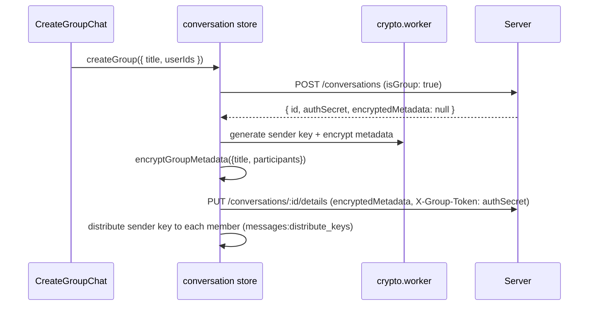

# 16 — Groups

How group conversations are created, how metadata and messages are encrypted, how sender keys are distributed, and how membership changes are handled.

> **✅ Blueprint 26 IMPLEMENTED (2026-09-26).** The group-privacy tiers are
> shipped and supersede parts of this document:
>
> | Tier | What changed | Section |
> |---|---|---|
> | **T1** | Sender pseudonyms — group `senderId` is a per-group random pseudonym (metadata v2 `pseudonymMap`, generation counter); server stores verbatim | replaces 16.4 routing notes |
> | **T3a** | Group `MessageStatus.userId` stores the reader's **pseudonym**, not the account id | new |
> | **T3b** | Blinded membership discovery via per-member **delivery tokens** (`UserHiddenConversation.deliveryToken`, dual-accept sync) | extends 16.5 |
> | **T2** | Sender keys distributed **inside pairwise DR sessions** (`GROUP_KEY` silent control, virtual `<group>:pw:<peer>` conv id); `messages:distribute_keys` is now the legacy fallback | supersedes 16.4 delivery |
> | **T4** | Opt-in application-level **cover traffic** (Poisson scheduler, `COVER` silent type, drop-after-decrypt) | new |
>
> Design rationale, threat model, and residual leaks: **docs/26-group-privacy-blueprint.md** (decisions locked in 26.7). This document remains accurate for the 1:1 sealed-sender path, legacy (v1) groups, and the metadata decryption-once fix (16.3).

## 16.1 Overview

Groups use the **Sender-Key protocol** (client-side fan-out). The server is a blind relay: it never sees group keys, member names, or message content — only opaque conversation records and ciphertext.

**Key files:** `web/src/store/conversation.ts` (group creation + metadata), `web/src/utils/crypto.ts` (`ensureGroupSession`, `encryptGroupMetadata`, `decryptGroupMetadata`), `web/src/lib/keychainDb.ts` (sender-key state at rest), `web/src/store/message.ts` (group send path), `server/src/routes/conversations.ts`, `server/src/routes/messages.ts`.

## 16.2 Creation flow

- `authSecret` is a blind authorization token: the server checks `X-Group-Token` against it for detail/participant mutations, without knowing who the admin is.
- The group creator distributes its sender key to every participant via `messages:distribute_keys` → persisted as SYSTEM messages so offline members receive keys later.

## 16.3 Metadata encryption & the "Unknown Group" problem

- Group metadata (title, participant list) is encrypted with the creator's sender key at ratchet **N=0**.
- **Decryption-once problem:** the sender-key ratchet advances past N=0 as messages are decrypted. Re-decrypting metadata at N=0 later fails, which would show the group as "Unknown" and hide its messages.
- **Fix (persistence):** after the first successful metadata decrypt, the result is persisted to the Shadow Vault (`saveConversation` → `db.conversations.decryptedMetadata`), so subsequent loads reuse the cache instead of re-decrypting. Participant IDs are additionally cached via `saveCachedGroupParticipants`.

## 16.4 Sender-key distribution & rotation

- Each sender maintains its own chain `{CK, N, initialCK, chainId, metadataKey}` per conversation (`groupSenderStates`); each recipient maintains **one receiver state per `(conversation, senderDeviceKey)`** carrying `{CK, N, eraCK, chainId, metadataKey, skippedKeys, signingKey}` (`groupReceiverStates`) — all encrypted at rest with the `ENC1:` envelope.
- **[T2 — implemented]** Distribution runs through the single `sendGroupSenderKeyDistribution` path → `group:fulfilled_key` → `session:new_key` → `storeReceivedSessionKey` (realtime **and** persisted as a SYSTEM `GROUP_KEY` row, 7-day TTL, for offline catch-up). The old pairwise-DR control-message transport and `messages:distribute_keys` are removed.
- **[V2 — 2026-10-02]** The distribution envelope is a libsignal `SenderKeyDistributionMessage` v2: `[0x02][chainId(8)][u32 iter][CK(32)][metadataKey(32)]` (77 bytes), sealed per device (`pq_box_seal`). See §16.7.2.
- **[T1 — implemented]** Group senders sign/route with a per-group pseudonym (metadata v2); receiver states key off the sender **device identity key** (stable across pseudonym rotations).
- **Rotation invariants (fixed 2026-10):** `fulfillGroupKeyRequest` always seals the chain key at its **initial state `(initialCK, N=0)`** (`GroupSenderState.initialCK` is persisted at rest) so late joiners decrypt metadata again; metadata mutations redistribute the **same** era via `redistributeCurrentGroupKey` instead of minting a second era per change (the old double-era bug left new members in `waiting_for_key` forever). A fresh era is only created when the sender state is empty.
- **Rotation** (`rotateGroupKey`, admin-only active path): replaces **only the local sender state** (era sources of other senders and their archives are preserved — multi-era, see §16.7.1), re-encrypts metadata v2/v3 with a fresh pseudonym map (generation+1), `PUT /details` **and emits `metadata:updated`** so every member receives the new blob + roster in real time (2026-10-05 — previously only the PUT happened and other members kept the old roster until reload). Delivery-token maps are inherited, never rotated.

## 16.5 Membership operations

| Op | Client | Server |
|---|---|---|
| Add participant | `addParticipants` | `POST /:id/participants` (X-Group-Token) → broadcast `conversation:new` |
| Remove participant | `removeParticipant` | `DELETE /:id/participants/:userId` → `conversation:participant_removed` |
| Leave (member) | solo-leave dialog | `DELETE /:id/leave` — MEMBER leaves without purge |
| Leave (admin/owner) | warning dialog → confirm | `DELETE /:id/group` (purge) + auto-transfer owner to the earliest-joined remaining member |
| Delete (admin) | `deleteGroup` | `DELETE /:id/group` → `conversation:deleted` (X-Admin-Token guard; 409 `MEMBERS_REMAIN` while delivery tokens remain) |

All membership changes force a sender-key rotation so removed members cannot read future messages (PFS for groups).

### 16.5.1 Admin capability token (RBAC, 2026-10)

The server never learns roles (Opaque Mailbox), so authorization = possession of a capability:

- **Creation:** `createGroup` generates a random 256-bit admin token client-side; the server receives only its SHA-256 hex (`Conversation.adminSecretHash`, validated `^[a-f0-9]{64}$`). The client caches the plaintext token per conversation in kvStore `nyx_group_admin_tokens` (at-rest `ENC1:`), hydrated in `loadConversations`.
- **Guard:** `requireAdminCapability` (`server/src/utils/adminCapability.ts`) gates `PUT /:id/details`, `POST /:id/key-rotation`, and `DELETE /:id/group` via header `X-Admin-Token` (constant-time compare against the stored hash). **NULL hash = legacy bypass** — pre-RBAC groups keep using `X-Group-Token`.
- **Distribution:** the token is sealed pairwise (`pq_box_seal`) to each member and relayed via `group:fulfilled_key` with the `adminToken: true` flag (realtime + offline sync branch in `message.ts` — processed as a capability, never as a chain key). Done at group creation, on MEMBER→ADMIN promotion, re-sealed to all other admins on every `rotateGroupKey`, and transferred to the successor admin when the owner leaves.
- **UI gating:** rotate-key button (`amIAdmin`), "Delete Group" menu/swipe entry (`canDeleteGroup`), and the solo-leave dialog variant all check admin status locally; the server-side guard is the source of truth.
- **Trade-off:** the server cannot distinguish between admins and a stolen token stays valid until the next rotation — mitigated by re-sealing on every membership change.

**[T3b — implemented]** Adds/leaves/kicks also write or delete the member's **delivery token** row (`UserHiddenConversation.deliveryToken`): tokens are issued by the inviter at add-time and revoked (= row deleted) on kick/leave, so kicked members lose discovery access without any identity join. Full design: docs 26.2 / 26.10.

## 16.6 Group info & UI

- `GroupInfoPanel` / `EditGroupInfoModal` show/edit the decrypted metadata; `ParticipantList` renders members from the decrypted participant list (with per-user profile enrichment via `useUserProfile`).
- `AddParticipantModal` picks users and triggers the add flow.

## 16.7 Edge cases & invariants

- **Metadata missing → "Unknown":** now mitigated by persisting decrypted metadata; if it still happens, `repairSecureSession` / a ghost sync re-fetches the group key.
- **Member sends before metadata decrypt:** non-creator members reconstruct the participant list from `getCachedGroupParticipants` (opaque-mailbox fallback) so they can send immediately.
- **Key rotation pending:** `requiresKeyRotation` flag + `fireGhostSync` reconcile state after a metadata/participant mismatch.

### 16.7.1 The four era invariants (2026-10, libsignal-derived)

Adopted after comparing the group pipeline against libsignal's `SenderKeyRecord` /
`process_sender_key_distribution_message` (`~/signal/libsignal/.../sender_keys.rs`,
`group_cipher.rs`). These invariants eliminate the whole class of
"decrypted-then-failed-again" bugs (reload / relogin / kick+re-add):

1. **Multi-era receiver state.** Receiver states carry an **era anchor**
   (`GroupReceiverState.eraCK` = chain key at the start of the era, N=0). Before a
   new era overwrites the current state, the old state is **archived**
   (`archiveGroupReceiverState`, id `` `${id}#era_${CK8}` ``, max 5 — mirrors
   `MAX_SENDER_KEY_STATES=5`) and stays routable via the keyId scan in
   `getGroupReceiverStateByKeyId`. **Never overwrite a live era.**
2. **Idempotent receive.** A re-delivered distribution for the **same** era is a
   no-op — it must never rewind a receiver that already advanced (the 2026-10-02
   rewind bug: persistent `fulfilled_key` envelopes replay on every offline sync,
   comparing raw CK made each replay look like a new era). Detection logic is the
   pure helper `isSameEraDistribution` (`web/src/lib/groupEra.ts`, unit-tested in
   `groupEra.test.ts`); legacy anchor-less states are handled safely.
3. **Persist-before-render.** Successful `reDecryptPendingMessages` results are
   written to the Shadow Vault (previously Zustand-only — bubbles looked fine but
   the vault still held the failure, so a reload lost them). `upsertMessages`
   **rejects every failure bubble** (`m.error` or any failure string — the old
   Indonesian failure strings slipped the hasContent filter and got poisoned
   permanently, with the "prevent overwriting valid message" shield protecting
   the *failure*). The `isLocalValid` blacklist in both load paths is widened so
   poisoned tombstones are re-decryptable when keys arrive.
4. **Targeted heal.** Key requests go **to the sender of the failed message**
   (pseudonym → userId resolve), not broadcast to the group — mirrors Signal's
   `DecryptionErrorMessage` flow (`Signal-Desktop ts/util/handleRetry.preload.ts`,
   5-retry / 14-day limits there). The first-message-of-a-new-group bug is closed
   by hooking `reDecryptPendingMessages` to the moment metadata **newly** decrypts
   in `addOrUpdateConversation` (previously `storeReceivedSessionKey` skipped the
   re-decrypt while metadata was pending and nothing followed up).

Also (MK persistence): group **skipped keys are no longer deleted after use** —
capped at 200/conversation (LRU) in `storeGroupSkippedKey` — so repeated reloads
can still decrypt messages whose message keys the ratchet already passed.

### 16.7.2 Sender-key v2 rewrite: true libsignal model (2026-10-02)

After 30+ incremental fixes kept hitting the same layer, the group sender-key
pipeline was rewritten in place to follow `sender_keys.rs` exactly. The five
planned changes, all implemented:

1. **Header v2: random 64-bit `chainId` + iteration.** Era creation
   (`group_init_sender_key`) now generates `(chainKey, chainId, metadataKey)`.
   The `chainId` is RANDOM per era — not derived from the chain key — and the
   v2 wrapper carries `{ v: 2, chainId, header.n }`; the legacy
   `keyId = CK[0:8]` is gone from v2 wrappers. Receiver routing goes through
   the pure helper `pickChainState` (`web/src/lib/groupEra.ts`, unit-tested):
   match `chainId` against current + archived states (newest first, max 5 —
   `MAX_SENDER_KEY_STATES`), never guess. v1 wrappers (keyId, no version) are
   still routed via keyId/eraCK matching.
2. **Metadata is OUT of the chain.** Each era distributes a dedicated
   256-bit `metadataKey` inside the same per-device envelope. Metadata v2 =
   `{ v: 2, kind: 'group_metadata', chainId, ct (XChaCha envelope), signature,
   senderDeviceKey }` — encrypted with the era metadata key, signed by the
   writer. No chain position, no sender-state restore, so the "twin"
   (metadata + next message sharing a position/MK) is impossible by
   construction. v1 chain-encrypted metadata remains readable (reader kept).
3. **One `SenderKeyRecord` per `(conversationId, senderDeviceKey)`, device-keyed
   id, states carry `chainId`, skipped message keys live inside the record
   (`sender_message_keys` map passed into `group_ratchet_decrypt` and persisted
   with the result), all at-rest encrypted.** The old unfiltered array-scan
   fallback in `getGroupSkippedKey` (matched `(conv, sender, n)` ignoring chain
   AND device) is removed — it handed back wrong-era MKs once same-position
   entries from multiple eras existed (MAC failures for established members,
   log 17:06). The `groupSkippedKeys` table survives only as a strictly-keyed
   mirror for v1 data still in prod.
4. **One distribution path: `sendGroupSenderKeyDistribution`.**
   `SenderKeyDistributionMessage v2` =
   `[0x02][chainId(8)][u32 iter=0][CK(32)][metadataKey(32)]`, pq_box_seal per
   device — used by create (`ensureGroupSession`), rotate
   (`redistributeCurrentGroupKey`), fulfill (`fulfillGroupKeyRequest`) and the
   SYSTEM_KEY_REQUEST reply (which now just calls fulfill). The duplicated
   manual seal loops are deleted.
5. **Version byte + v1 readers.** Envelope v2 starts with `0x02`; the 36-byte
   (`[u32 iter][CK]`) and 32-byte legacy envelopes and v1 wrappers are still
   parsed (prod has real data). Bounded migration heal: a legacy record that
   advanced past a needed position re-derives once from `(eraCK, 0)`.

Also: `group:request_key` is routed server-side by **`targetDeviceKey`**
(`Device.publicKey` → userId) when `targetSenderId` is an unresolvable
pseudonym — a member whose metadata is still undecrypted can reach every
sender, not only the creator.

### 16.7.3 Audit vs libsignal + stabilization pass (2026-10-05)

A full audit of the v2 pipeline against `sender_keys.rs` / `group_cipher.rs`
found and fixed the remaining holes. All verified with the full unit suite
(web vitest 176, server node:test 102) and a 3-browser manual test.

**Distribution correctness:**

- `listGroupReceiverStates` now returns `metadataKey` (decrypted at rest).
  It is the data source for `findGroupReceiverState` — the single routing
  door used by both message and metadata decryption — so metadata v2 was
  failing with "metadataKey era belum tersedia" even with the state present.
- `storeReceivedSessionKey` skip-own now compares **`senderDeviceKey` with
  the local device identity key**, not the userId/pseudonym — distributions
  from another device of the same account were being skipped, breaking
  cross-device group sync.
- Offline GROUP_KEY paths (`messagePipeline`) forward `senderSigningKey`;
  without it, states built from offline sync had no bound signing key and
  metadata v2 decryption failed there only.
- `decryptMessage`'s signing-key fallback fetches are guarded by
  `!keyToUse`: the fetch ran **per incoming message** even when the state
  already carried the signing key, burning the OTPK fetch quota
  (30 per pair per day, fail-closed 429) — once one pair tripped the limit,
  every bulk bundle fetch by that account failed and distributions came out
  empty (recipients stuck `waiting_for_key`).

**Era & state hygiene:**

- `rotateGroupKey` replaces **only the local sender state** — it no longer
  wipes receiver states, era archives, or skipped keys (`deleteGroupStates`
  removed from the flow); old-era messages stay readable and
  `handleGroupKeyDistribution` archives eras on arrival (invariant 1).
- The self-receiver state minted in `ensureGroupSession` carries
  `signingKey` — metadata v2 decryption demands `record.signingKey`, so a
  writer re-reading its own blob failed otherwise.
- `updateConversation` no longer force-rotates the sender key on roster
  change (era churn: two eras minted within seconds); membership rotation
  stays an explicit admin operation.
- `rotateGroupKey` emits `metadata:updated` after `PUT /details` so every
  member receives the new blob + roster in real time.
- Stale `METADATA_UPDATED` replays (7-day persisted SYSTEM rows) can no
  longer overwrite a **newer, already-decrypted** blob in the conversation
  store (anti-regression guard in `addOrUpdateConversation` /
  `updateConversation`).

**Forward secrecy of pre-join eras (by design):** messages from eras a
member never possessed (e.g. sent before they were added) are permanently
undecryptable. The unknown-era key request now runs **once per chainId**
(`unknownEraKeyRequested`) instead of re-looping request→timeout on every
re-decrypt sweep; the bubble rests as a placeholder.

## 16.8 Files to know

| File | Role |
|---|---|
| `web/src/store/conversation.ts` | `createGroup`, `addOrUpdateConversation`, `updateConversation`, participant ops |
| `web/src/utils/crypto.ts` | `ensureGroupSession`, `encryptGroupMetadata`, `decryptGroupMetadata`, `forceRotateGroupSenderKey` |
| `web/src/lib/keychainDb.ts` | sender/receiver ratchet state, era archives (`archiveGroupReceiverState`), skipped keys (LRU-capped), cached participants, at-rest encryption |
| `web/src/lib/messagePipeline.ts` | `GROUP_KEY_DISTRIBUTION` control handling |
| `server/src/routes/conversations.ts` | group endpoints + blind auth (`X-Group-Token`) + admin capability guard (`X-Admin-Token`) |
| `server/src/utils/adminCapability.ts` | `extractHeader`, `hashAdminToken`, `isAdminTokenValid` (+ 12 unit tests in `server/tests/adminCapability.test.ts`) |
| `web/src/lib/groupPseudonyms.ts` | `generateAdminCapabilityToken` / `storeMyAdminToken` / `hydrateMyAdminTokens` (kvStore `nyx_group_admin_tokens`) |
| `web/src/lib/groupEra.ts` | `isSameEraDistribution` (invariant 2) + `pickChainState` — pure era/replay detection & chain routing (unit-tested) |
| `server/src/network/redisBridge.ts` | `messages:distribute_keys`, `group:*` events |

**[Blueprint 26 additions]** `web/src/lib/groupPseudonyms.ts` (pseudonym + delivery-token maps), `web/src/lib/coverTraffic.ts` (Poisson cover scheduler), `web/src/utils/typeGuards.ts` (`GROUP_KEY` / `COVER` silent types), `server/tests/deliveryTokens.test.ts` (T3b contract).
