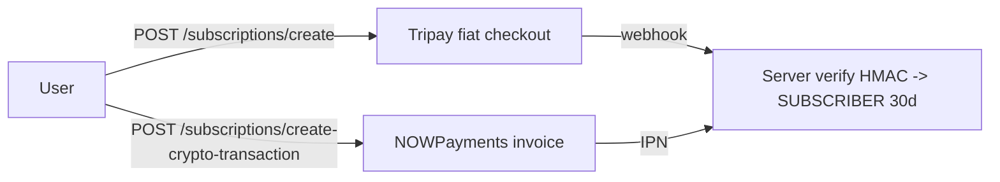

# 20 — Trust Tiers, Subscriptions & B2B (Engine)

Anti-spam trust tiers, the paid subscription flow (fiat + crypto), and the B2B tenant/embed "Engine" — plus the auxiliary AI/reporting/admin surfaces.

## 20.1 Trust tiers (anti-spam without PII)

| Tier | How you get it | Rate limits (`constants.ts` LIMITS) |
|---|---|---|
| **Sandbox (UNVERIFIED)** | default on registration | 5 msg/min, 0 groups, no uploads |
| **FREE (verified)** | `isVerified` via WebAuthn **or** PoW | 15 msg/min, 100 group members, 100 MB uploads |
| **SUBSCRIBER** | paid (see §20.2) | 50 msg/min, 500 members, 500 MB uploads |

- **Proof-of-Work:** `GET /api/auth/pow/challenge` (Argon2, difficulty escalates via Redis INCR), `POST /api/auth/pow/verify` sets `isVerified`.
- **WebAuthn verification** also registers a passkey (see `14-auth-identity.md`).
- The server enforces `sandbox:newchat:<user>:<date>` (max 3 new chats/day for unverified) via the atomic Lua counter.
- The client surfaces upgrade prompts in `SubscriptionModal`.

## 20.2 Subscriptions

- **Fiat — Tripay** (`subscriptions.ts`): creates a QRIS/e-wallet checkout (Rp 55.000 / 30 days). The `POST /webhook` callback verifies the `X-Callback-Signature` (HMAC-SHA256); on `PAID` the user is upgraded and `subscription_updated` is emitted.
- **Crypto — NOWPayments**: creates an invoice (`price_currency: idr`, `is_fee_paid_by_user`). `POST /nowpayments-webhook` verifies `X-NowPayments-Sig` (HMAC-SHA512 over key-sorted JSON); on `finished` the user is upgraded.
- Both webhook routes are exempt from CSRF and use **constant-time** signature comparison.
- **Expiry:** `GET /api/users/me` lazily downgrades expired subscribers; `systemSweeper` (daily) also downgrades.

## 20.3 B2B Engine (`/api/engine`)

- Tenants are created by admins (`POST /api/admin/tenants`) with an `apiKey`.
- `POST /api/engine/rooms` (authenticated by `x-nyx-engine-key` → `requireTenantAuth`): looks up/creates a tenant user (`usernameHash = sha256(tenant:externalId)`), creates a conversation, issues two short-lived iframe tokens, and returns `userAUrl`/`userBUrl` for `EmbedChatPage`.
- `EmbedChatPage` (`/embed/chat/:id`) renders a bare `ChatWindow` with a token, suitable for an iframe — no sidebar/layout.

## 20.4 Reports & admin

- `POST /api/reports/user` and `POST /api/reports` forward to Discord webhooks ("NYX Watchdog" / "NYX Reporter").
- **Admin console** (`/admin-console`, `AdminDashboard`): `GET /api/admin/system-status` (VPS/DB/R2 metrics), `banned-users`, `ban`/`unban`, `tenants` CRUD, `tenants/:id/toggle`.

## 20.6 Files to know

| File | Role |
|---|---|
| `web/src/store/verification.ts` | verified status |
| `web/src/components/SubscriptionModal.tsx` | upgrade UI |
| `web/src/pages/AdminDashboard.tsx` | admin console |
| `server/src/routes/subscriptions.ts` | Tripay + NOWPayments |
| `server/src/routes/auth.ts` | PoW challenge/verify |
| `server/src/routes/engine.ts` | B2B room factory |
| `server/src/routes/admin.ts` | admin endpoints |
| `server/src/routes/reports.ts` | Discord reports |
| `server/src/middleware/tenantAuth.ts` | tenant API key gate |
| `packages/shared/src/constants.ts` | LIMITS |
